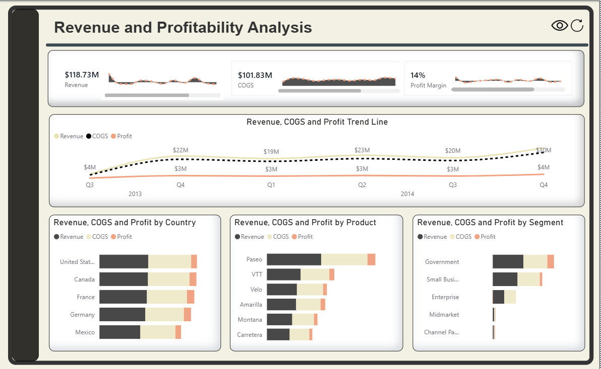
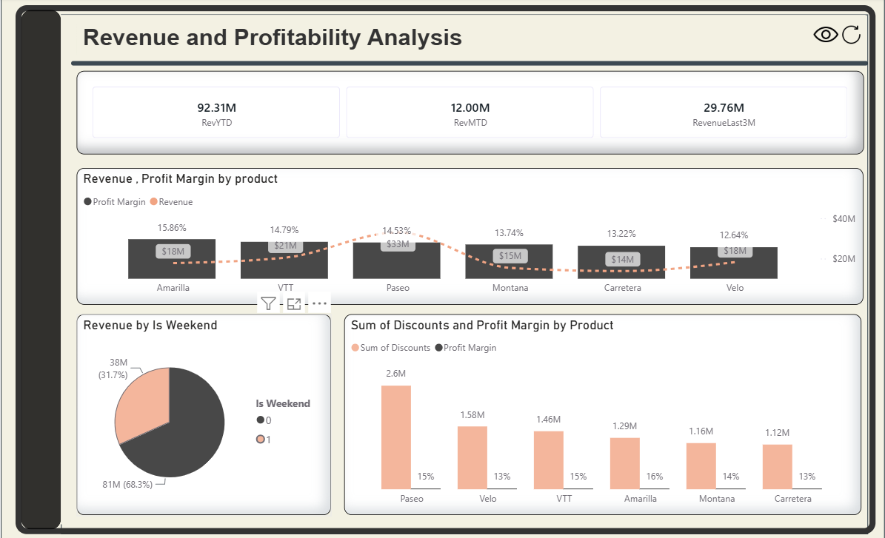

# Revenue & Profitability Analysis Dashboards

A Power BI dashboard developed to analyze revenue, profitability, costs, and overall business performance. The dashboard provides executive-level KPIs and detailed insights into revenue trends, profit margins, discount impacts, product performance, customer segments, and regional sales performance. It enables stakeholders to monitor financial health, identify high-performing products, evaluate profitability across markets, and support data-driven decision-making.

---

## Dashboard Previews

### Dashboard 1: Revenue & Profitability Overview

### Dashboard 2: Financial Performance Analysis

---

## Overview

This project demonstrates the complete Power BI development lifecycle, from data preparation and modeling to interactive dashboard creation. The dashboards focus on revenue generation, cost analysis, and profitability measurement, providing valuable insights into business performance across products, countries, and customer segments.

---

## Dashboard Breakdown

### Dashboard 1 — Revenue & Profitability Overview

A product-focused profitability dashboard featuring:

* Revenue YTD, Revenue MTD, and Revenue Last 3 Months KPIs.
* Revenue and Profit Margin by Product analysis.
* Revenue distribution between Weekend and Weekday sales.
* Discount Impact versus Profit Margin by Product.
* Product profitability comparison to identify top and low-performing products.
* Interactive filters and drill-through capabilities for deeper analysis.

### Dashboard 2 — Financial Performance Analysis

An executive-level financial dashboard featuring:

* Total Revenue, COGS, and Profit Margin KPIs.
* Revenue, COGS, and Profit trend analysis over time.
* Revenue, COGS, and Profit by Country.
* Revenue, COGS, and Profit by Product.
* Revenue, COGS, and Profit by Customer Segment.
* Comparative financial performance analysis across regions and business segments.

---

## Key Features & Techniques

| Feature                  | Description                                   |
| ------------------------ | --------------------------------------------- |
| Power Query              | Data cleaning and transformation              |
| Data Modeling            | Building relationships and analytical models  |
| DAX Measures             | Custom KPIs and profitability calculations    |
| Time Intelligence        | YTD, MTD, and rolling-period analysis         |
| Interactive Filters      | Dynamic filtering across multiple dimensions  |
| Financial Analytics      | Revenue, Cost, Profit, and Margin analysis    |
| Drill-Down Analysis      | Detailed exploration of products and segments |
| Executive KPI Monitoring | High-level business performance tracking      |
| Dashboard Design         | Clean and interactive reporting experience    |

---

## Tools & Skills Used

* Power BI Desktop
* Power Query
* DAX
* Data Modeling
* Data Visualization
* Financial Analysis
* Time Intelligence
* Business Intelligence Reporting

---

## Business Value

The dashboards help stakeholders monitor financial performance, evaluate product profitability, assess the impact of discounts, compare regional performance, and identify opportunities for improving revenue and profit margins. The solution supports data-driven decision-making through interactive and visually engaging analytics.
